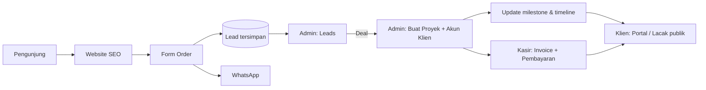

# PRD — KitaBikin Platform
**Product Requirements Document** · Versi 1.0 · Status: Disetujui untuk implementasi

---

## 1. Ringkasan Produk

**KitaBikin** adalah agensi solusi digital untuk **UMKM/bisnis umum** dan **sekolah/pendidikan**
(website, sistem POS & toko online, PPDB/akademik, media pembelajaran, game edukasi, aplikasi custom).

Platform ini terdiri dari tiga lapisan:

| Lapisan | Pengguna | Tujuan |
|---|---|---|
| **Website Publik** | Calon klien, Google | Menjual layanan, menampung leads, transparan soal progres |
| **Portal Klien** | Klien aktif | Memantau progres proyek, tagihan, dan berkomunikasi |
| **Panel Admin + POS** | Tim KitaBikin | Mengelola leads, proyek, klien, tagihan, dan pembayaran |

### 1.1 Masalah yang diselesaikan
1. Leads masuk lewat WhatsApp tercecer, tidak tercatat.
2. Klien sering bertanya "sudah sampai mana?" → membuang waktu tim.
3. Penagihan manual (chat/Excel), tidak ada bukti dan status yang jelas.
4. Website belum optimal di mesin pencari (SEO).

### 1.2 Tujuan & Metrik Sukses
| Tujuan | Metrik | Target |
|---|---|---|
| Menangkap semua leads | % leads tercatat di sistem | 100% |
| Mengurangi pertanyaan status | Jumlah chat "progress?" | −70% |
| Penagihan rapi | Invoice dengan status & riwayat bayar | 100% proyek |
| Visibilitas organik | Skor Lighthouse SEO | ≥ 95 |
| Performa | LCP halaman publik | < 2.5 dtk |

---

## 2. Persona

| Persona | Deskripsi | Kebutuhan utama |
|---|---|---|
| **Pemilik UMKM (Bu Sari)** | Punya toko/usaha, kurang paham teknis | Tahu progres tanpa bertanya, tagihan jelas |
| **Operator Sekolah (Pak Budi)** | Admin/guru TIK, urus PPDB & web sekolah | Update berkala, bisa kirim revisi |
| **Admin KitaBikin (Owner)** | Mengelola semua proyek | Satu dashboard: leads → proyek → tagihan |

---

## 3. Ruang Lingkup (Scope)

### 3.1 In-Scope (MVP — dikirim sekarang)
- Website publik dengan SEO lengkap + form order yang **tersimpan ke database**
- Halaman **Lacak Progres** publik (kode proyek)
- Autentikasi (login) dengan peran **admin** & **klien**
- **Panel Admin**: Dashboard, Leads, Proyek (milestone, update), Klien, **Kasir/POS Tagihan**
- **Portal Klien**: Proyek saya, timeline, milestone, tagihan, pesan
- Backend REST API + database SQLite
- Deployment-ready (build produksi disajikan satu server)

### 3.2 Out-of-Scope (fase berikutnya)
- Payment gateway otomatis (Midtrans/Xendit)
- Notifikasi WhatsApp/email otomatis
- Upload file/aset proyek
- Multi-tenant / multi-admin dengan peran granular
- Aplikasi mobile native

---

## 4. Kebutuhan Fungsional

### 4.1 Website Publik
| ID | Kebutuhan | Prioritas |
|---|---|---|
| FR-PUB-01 | Halaman Beranda, Layanan, Portofolio, Harga, Order, Lacak, 404 | P0 |
| FR-PUB-02 | Konten menyasar **UMKM/Bisnis** dan **Sekolah/Pendidikan** (sorot media pembelajaran & web sekolah) | P0 |
| FR-PUB-03 | Form Order menyimpan lead ke DB lalu membuka WhatsApp dengan pesan terisi | P0 |
| FR-PUB-04 | Lacak Progres: input kode proyek → tahap, persentase, milestone, update terbaru (tanpa data sensitif) | P0 |
| FR-PUB-05 | Domain & Hosting **tidak** dimasukkan dalam paket harga (dihitung terpisah) | P0 |
| FR-PUB-06 | Navigasi ke Login klien/admin | P1 |

### 4.2 Autentikasi
| ID | Kebutuhan | Prioritas |
|---|---|---|
| FR-AUTH-01 | Login email + password, token JWT | P0 |
| FR-AUTH-02 | Peran `admin` & `client`, rute dilindungi per peran | P0 |
| FR-AUTH-03 | Ganti password | P1 |
| FR-AUTH-04 | Akun klien dibuat admin (tidak ada registrasi publik) | P0 |
| FR-AUTH-05 | Rate-limit percobaan login | P0 |

### 4.3 Panel Admin + POS
| ID | Kebutuhan | Prioritas |
|---|---|---|
| FR-ADM-01 | Dashboard: leads baru, proyek aktif, klien, pendapatan bulan ini, piutang | P0 |
| FR-ADM-02 | **Leads**: daftar, ubah status (baru → dihubungi → penawaran → deal/batal), konversi ke proyek | P0 |
| FR-ADM-03 | **Proyek**: buat/ubah/hapus, tahap, anggaran, tenggat, kode otomatis `KB-XXXXXX` | P0 |
| FR-ADM-04 | **Milestone**: tambah, centang selesai, hapus; progres % dihitung otomatis | P0 |
| FR-ADM-05 | **Update/Timeline**: posting kabar progres yang tampil ke klien | P0 |
| FR-ADM-06 | **Klien**: buat akun, edit, nonaktifkan, reset password | P0 |
| FR-ADM-07 | **Kasir/POS**: buat invoice (multi item), catat pembayaran (tunai/transfer/QRIS), status otomatis (belum/sebagian/lunas) | P0 |
| FR-ADM-08 | Cetak invoice (print-friendly) | P1 |
| FR-ADM-09 | Pesan per proyek (balas klien) | P1 |

### 4.4 Portal Klien
| ID | Kebutuhan | Prioritas |
|---|---|---|
| FR-CLI-01 | Ringkasan: proyek aktif, progres, tagihan belum lunas | P0 |
| FR-CLI-02 | Detail proyek: tahap, % progres, milestone, timeline update | P0 |
| FR-CLI-03 | Daftar tagihan + riwayat pembayaran + cetak | P0 |
| FR-CLI-04 | Kirim pesan/revisi ke tim per proyek | P1 |
| FR-CLI-05 | Klien hanya dapat melihat data miliknya sendiri | P0 |

### 4.5 Tahap Proyek (state machine)
`briefing → desain → pengembangan → revisi → peluncuran → selesai` (+ `ditunda`)

---

## 5. Kebutuhan Non-Fungsional

| Kategori | Kebutuhan |
|---|---|
| **SEO** | Title & meta unik per halaman, canonical, Open Graph, Twitter Card, JSON-LD (Organization, WebSite, ProfessionalService), `sitemap.xml`, `robots.txt`, heading H1 tunggal, `lang="id"`, area admin/klien `noindex` |
| **Keamanan** | Hash bcrypt, JWT bertanda tangan, Helmet, CORS terkontrol, rate-limit, validasi input (Zod), query parameter (anti SQL injection), otorisasi per peran & kepemilikan |
| **Performa** | Code-splitting per halaman (lazy), font `display=swap`, gambar lazy, LCP < 2.5 dtk |
| **Aksesibilitas** | Kontras WCAG AA, label form, fokus terlihat, atribut `alt` |
| **Responsif** | Mobile-first; dashboard dapat dipakai di ponsel |
| **Keandalan** | Skema DB dengan foreign key & transaksi; seed idempoten |
| **Maintainability** | Struktur modular, dokumentasi PRD/SDD/README, lint bersih |
| **Lokalisasi** | Bahasa Indonesia, mata uang Rupiah, zona waktu WIB |

---

## 6. Desain & Brand
- **Logo**: ikon + wordmark, biru `#1E3A8A` & oranye `#F97316`
- **Tema**: default **off-white `#FAF9F6`** + **oranye**
- **Tipografi**: Outfit (utama), Caveat (aksen tulisan tangan)
- **Gaya**: kartu putih lembut, sudut membulat, bayangan halus, micro-animation

---

## 7. Alur Pengguna Utama

---

## 8. Rilis & Roadmap
| Fase | Isi | Status |
|---|---|---|
| **v1.0 (MVP)** | Semua yang di bagian 3.1 | ✅ Implementasi |
| v1.1 | Notifikasi WhatsApp/email, upload file | Rencana |
| v1.2 | Payment gateway (Midtrans/Xendit), PDF invoice server-side | Rencana |
| v2.0 | Multi-admin, laporan keuangan, kontrak digital | Rencana |

## 9. Risiko
| Risiko | Mitigasi |
|---|---|
| SQLite untuk beban tinggi | Layer data terisolasi; migrasi ke PostgreSQL mudah |
| SPA kurang ramah crawler | Meta dinamis per rute + JSON-LD + sitemap; opsi prerender fase lanjut |
| Kebocoran kode lacak | Kode acak 6 karakter, data publik minimal, rate-limit |
| Password default produksi | Produksi **wajib** `ADMIN_PASSWORD` & `JWT_SECRET` dari env |
