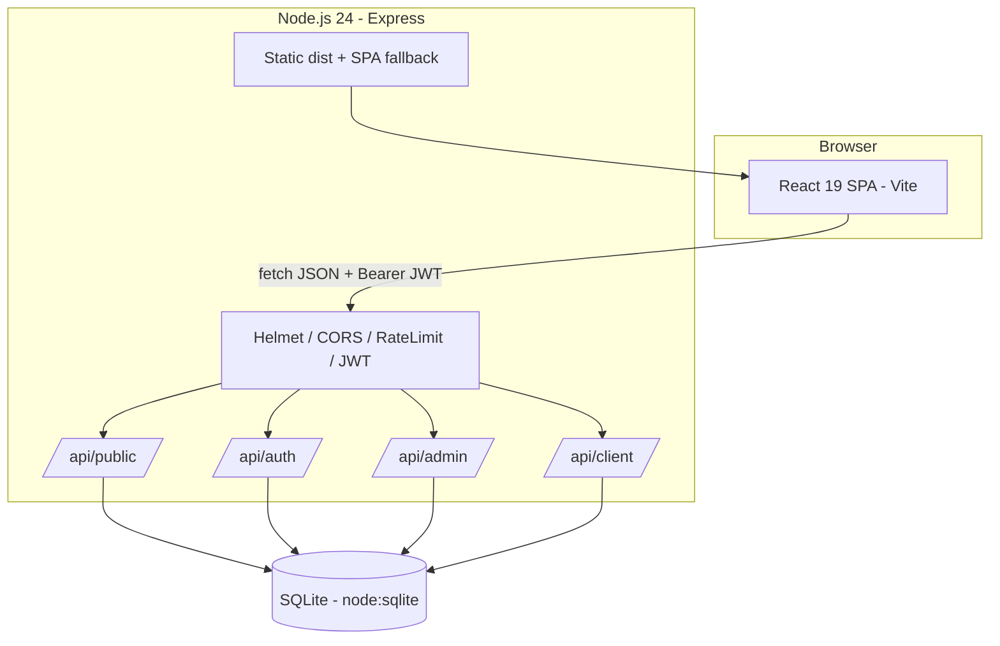
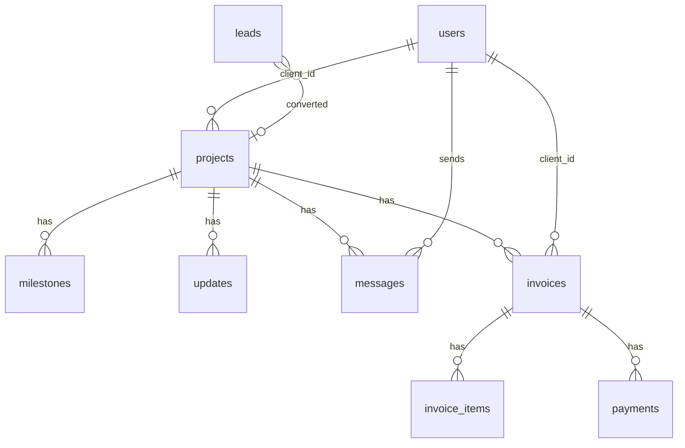

# SDD — KitaBikin Platform
**Software Design Document** · Versi 1.0 · Pasangan dari [PRD_KitaBikin.md](./PRD_KitaBikin.md)

---

## 1. Arsitektur



**Keputusan arsitektur (ADR ringkas)**

| # | Keputusan | Alasan |
|---|---|---|
| 1 | **Express + SQLite (`node:sqlite`)** | Nol dependensi native, tanpa akun cloud, jalan lokal & mudah di-deploy (1 proses). Layer `db.js` terisolasi → mudah pindah ke PostgreSQL |
| 2 | **JWT stateless (Bearer)** | Sederhana untuk SPA; masa berlaku 7 hari |
| 3 | **bcryptjs** | Pure JS, tanpa kompilasi native di Windows |
| 4 | **Zod** untuk validasi | Skema deklaratif, pesan error konsisten |
| 5 | **Satu server melayani API + build SPA** | Deploy sederhana (VPS/Render/Railway) |
| 6 | **SEO dengan hook `useSEO` + JSON-LD** | Tanpa dependensi tambahan; meta diperbarui per rute |
| 7 | **Lazy routes** | Memangkas bundle awal halaman publik |

---

## 2. Struktur Folder

```
kitabikin/
├─ docs/                    PRD, SDD
├─ public/                  logo, favicon, robots.txt, sitemap.xml, og-image
├─ server/
│  ├─ index.js              bootstrap Express
│  ├─ config.js             env & konstanta
│  ├─ db.js                 koneksi + skema + helper transaksi
│  ├─ seed.js               data awal (admin + demo)
│  ├─ middleware/
│  │  ├─ auth.js            verifikasi JWT, requireRole
│  │  ├─ validate.js        wrapper Zod
│  │  └─ error.js           404 + error handler
│  ├─ routes/
│  │  ├─ auth.js            login, me, change-password
│  │  ├─ public.js          leads, track
│  │  ├─ admin.js           stats, leads, clients, projects, invoices
│  │  └─ client.js          projects, invoices, messages
│  └─ utils/
│     ├─ projects.js        helper (progres, kode, serialisasi)
│     └─ invoices.js        total, status, nomor
├─ src/
│  ├─ main.jsx, App.jsx
│  ├─ lib/ api.js, format.js, constants.js, seo.js
│  ├─ context/AuthContext.jsx
│  ├─ components/ Navbar, Footer, FloatingWhatsApp, ProtectedRoute,
│  │              DashboardLayout, StatusBadge, ProgressBar, Modal, SEO
│  └─ pages/
│     ├─ Home, Services, Portfolio, Pricing, Order, Track, Login, NotFound
│     ├─ admin/  Overview, Leads, Projects, ProjectDetail, Clients, Invoices, InvoiceView
│     └─ client/ Overview, ProjectDetail, Invoices
├─ data/                    kitabikin.db (gitignored)
├─ .env.example
└─ package.json
```

---

## 3. Model Data (ERD)



### 3.1 Tabel

| Tabel | Kolom penting |
|---|---|
| `users` | id, name, email (unique), password_hash, role (`admin`/`client`), phone, organization, active, created_at |
| `leads` | id, name, contact, service, description, status (`baru`/`dihubungi`/`penawaran`/`deal`/`batal`), project_id, created_at |
| `projects` | id, code (unique `KB-XXXXXX`), client_id, title, service, description, stage, progress, budget, start_date, due_date, created_at, updated_at |
| `milestones` | id, project_id, title, done, sort_order |
| `updates` | id, project_id, title, body, created_at |
| `messages` | id, project_id, sender_id, body, created_at |
| `invoices` | id, number (unique `INV-YYYYMM-NNN`), project_id, client_id, issue_date, due_date, status (`belum`/`sebagian`/`lunas`/`batal`), notes |
| `invoice_items` | id, invoice_id, description, qty, price |
| `payments` | id, invoice_id, amount, method (`tunai`/`transfer`/`qris`), paid_at, note |

Uang disimpan sebagai **integer Rupiah** (tanpa desimal). Tanggal ISO-8601 (UTC).

### 3.2 Aturan Bisnis
- **Progres** = `round(done / total * 100)` jika proyek punya milestone; jika tidak, nilai manual.
- **Status invoice** dihitung ulang tiap pembayaran: `paid = 0 → belum`, `0 < paid < total → sebagian`, `paid ≥ total → lunas`. `batal` ditetapkan manual.
- **Konversi lead → proyek**: membuat proyek (dan akun klien jika diminta) lalu set lead `deal`.
- Proyek `selesai` otomatis progres 100.
- Klien nonaktif tidak dapat login.

---

## 4. Desain API

Base: `/api` · Format: JSON · Error: `{ "error": "pesan", "details"?: [...] }`
Auth: header `Authorization: Bearer <jwt>`.

### 4.1 Publik
| Method | Path | Deskripsi |
|---|---|---|
| GET | `/api/health` | Cek hidup |
| POST | `/api/public/leads` | Simpan lead (rate-limited) |
| GET | `/api/public/track/:code` | Progres publik (tahap, %, milestone, 5 update terakhir) |

### 4.2 Auth
| Method | Path | Deskripsi |
|---|---|---|
| POST | `/api/auth/login` | `{email,password}` → `{token,user}` |
| GET | `/api/auth/me` | User saat ini |
| POST | `/api/auth/change-password` | `{currentPassword,newPassword}` |

### 4.3 Admin (`role=admin`)
| Method | Path | Deskripsi |
|---|---|---|
| GET | `/api/admin/stats` | Ringkasan dashboard |
| GET | `/api/admin/leads` | Daftar leads |
| PATCH | `/api/admin/leads/:id` | Ubah status |
| DELETE | `/api/admin/leads/:id` | Hapus |
| POST | `/api/admin/leads/:id/convert` | Konversi ke proyek (+ akun klien opsional) |
| GET/POST | `/api/admin/clients` | Daftar / buat klien |
| PATCH | `/api/admin/clients/:id` | Edit / nonaktifkan / reset password |
| GET/POST | `/api/admin/projects` | Daftar / buat proyek |
| GET/PATCH/DELETE | `/api/admin/projects/:id` | Detail / ubah / hapus |
| POST | `/api/admin/projects/:id/milestones` | Tambah milestone |
| PATCH/DELETE | `/api/admin/milestones/:id` | Centang / hapus |
| POST | `/api/admin/projects/:id/updates` | Posting update |
| DELETE | `/api/admin/updates/:id` | Hapus update |
| POST | `/api/admin/projects/:id/messages` | Balas pesan |
| GET/POST | `/api/admin/invoices` | Daftar / buat invoice |
| GET/PATCH | `/api/admin/invoices/:id` | Detail / ubah status |
| POST | `/api/admin/invoices/:id/payments` | Catat pembayaran |
| DELETE | `/api/admin/payments/:id` | Batalkan pembayaran |

### 4.4 Klien (`role=client`, hanya data miliknya)
| Method | Path | Deskripsi |
|---|---|---|
| GET | `/api/client/overview` | Ringkasan |
| GET | `/api/client/projects` | Proyek saya |
| GET | `/api/client/projects/:id` | Detail + milestone + update + pesan |
| POST | `/api/client/projects/:id/messages` | Kirim pesan |
| GET | `/api/client/invoices` | Tagihan saya |
| GET | `/api/client/invoices/:id` | Detail tagihan |

### 4.5 Kode Status HTTP
`200/201` sukses · `400` validasi · `401` belum login · `403` peran/kepemilikan salah · `404` tidak ada · `409` duplikat · `429` rate-limit · `500` galat server.

---

## 5. Keamanan
| Ancaman | Kontrol |
|---|---|
| Brute-force login | `express-rate-limit` 10 percobaan / 15 menit / IP |
| Spam leads | Rate-limit 20 / jam / IP + honeypot field |
| SQL injection | Prepared statements 100% |
| XSS | React escape default, Helmet CSP dasar, tidak ada `dangerouslySetInnerHTML` |
| IDOR | Setiap query klien difilter `client_id = req.user.id` |
| Token bocor | Secret dari env; produksi wajib; kedaluwarsa 7 hari |
| Enumerasi user | Pesan login generik "Email atau password salah" |
| Default credential | Produksi menolak start tanpa `ADMIN_PASSWORD` |

---

## 6. Frontend

### 6.1 Rute
| Path | Akses | Komponen |
|---|---|---|
| `/` `/layanan` `/portofolio` `/harga` `/order` `/lacak` | Publik | Halaman publik |
| `/masuk` | Publik | Login |
| `/admin` · `/admin/leads` · `/admin/proyek` · `/admin/proyek/:id` · `/admin/klien` · `/admin/kasir` · `/admin/kasir/:id` | Admin | Panel admin |
| `/klien` · `/klien/proyek/:id` · `/klien/tagihan` · `/klien/tagihan/:id` | Klien | Portal klien |

### 6.2 State
- `AuthContext`: `user`, `token` (localStorage), `login()`, `logout()`.
- Data per halaman diambil via `api.js` (`fetch` wrapper otomatis menyisipkan token & menangani 401 → logout).

### 6.3 SEO
- `useSEO({title, description, path, noindex, jsonLd})` memperbarui `<title>`, meta description, canonical, OG, Twitter, robots.
- `index.html` memuat default + JSON-LD Organization/WebSite.
- `public/sitemap.xml` + `robots.txt` (Disallow `/admin`, `/klien`, `/masuk`, `/api`).
- Dashboard memakai `noindex, nofollow`.

### 6.4 Desain Sistem
Token CSS di `index.css` (`--primary`, `--secondary`, `--background`, …). Komponen dashboard memakai kelas CSS (`dash-*`), bukan inline-style, agar konsisten & responsif.

---

## 7. Konfigurasi (`.env`)
| Var | Default dev | Keterangan |
|---|---|---|
| `PORT` | 4000 | Port API |
| `JWT_SECRET` | dev-secret | **Wajib** di produksi |
| `ADMIN_EMAIL` | admin@kitabikin.id | Akun admin awal |
| `ADMIN_PASSWORD` | Admin#12345 (dev) | **Wajib** di produksi |
| `SEED_DEMO` | true (dev) | Isi data contoh |
| `DB_PATH` | ./data/kitabikin.db | Lokasi database |
| `CORS_ORIGIN` | http://localhost:5173 | Origin diizinkan |
| `SITE_URL` | https://kitabikin.id | Untuk canonical/sitemap |

## 8. Menjalankan & Deploy
```bash
npm install
cp .env.example .env
npm run dev:all        # API :4000 + Vite :5173 (proxy /api)
npm run build && npm start   # produksi: satu server
```
Deploy: VPS/Render/Railway — set env, jalankan `npm run build && npm start`, mount volume untuk `data/`. Cadangkan file `.db` berkala.

## 9. Strategi Pengujian
- **Smoke test API** (`npm run test:api`): login, buat klien, proyek, milestone, invoice, pembayaran, otorisasi lintas peran.
- Lint (`npm run lint`) dan `vite build` harus bersih.
- Manual: alur order → lead → proyek → klien lihat progres.

## 10. Peningkatan Mendatang
Payment gateway, notifikasi WA/email, upload file, PDF invoice, audit log, migrasi PostgreSQL, prerender SEO (vite-plugin-ssg).
